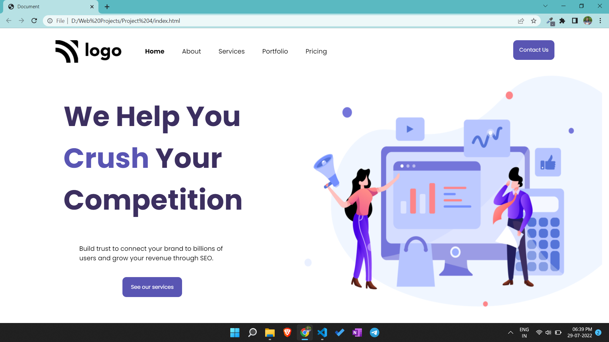

# Portfolio project 3

This is a one page portfolio template project made in HTML and CSS.

# Project live link

[Portfolio-project-3](https://tranquil-bombolone-400b7b.netlify.app)

# Screenshot

# My learnings from this projects

- I learned to design beautiful buttons and navbar.
- I learned to add different fonts from google fonts.

# Time to finish the projecet

I took about 3 hours approximately to complete this project.
